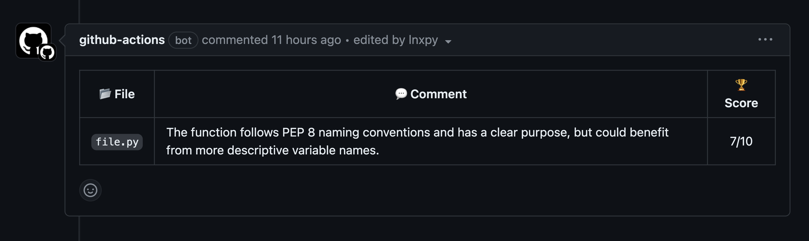

An AI code reviewing action that leaves its thoughts whenever someone opens a pull request on your repository. Let AI approve it, then just merge it!

## Setup
You have to create a MindsDB account [here](https://cloud.mindsdb.com/login) and log into it. Then train a GPT model based on your desired prompt and share the credentials with RevAI so that it'll be able to comment on changes.

Once you've created the account, follow the steps here.

### 1. Get an `API_KEY` from OpenAI
Create an account on [here](https://openai.com/) and generate a chatGPT access token. Copy that into your clipboard.

### 2. Train the model
Navigate to your [dashboard](https://cloud.mindsdb.com/home) and create a new instance. Execute the following snippet in your instance editor.

> Replace your OpenAI token with `<YOUR-TOKEN>`.

```sql
CREATE MODEL mindsdb.gpt_model
PREDICT response
USING
engine = 'openai',
api_key = '<YOUR-TOKEN>',
model_name = 'gpt-3.5-turbo', -- you can also use 'text-davinci-003' or 'gpt-3.5-turbo'
prompt_template = 'review the {{text}} based on clean-code principles and pep rules then rate it from 1 to 10 and put it in the "score" field. Put your thoughts about it in one sentence in the "message" field.

Respond with no formatting, but in the following structure:

{
    "score": int,
    "message": str
}'; 
```

## Usage
In this step..
Now, it's time to use RevAI and see the magic.

### 1. Create comment template
Create `.github/comment-template.md` file and put the template you want RevAI to put its comments inside.

You can use the following example as your `comment-template.md`.
```
| 📂 **File**   | 💬 **Comment** | 🏆 **Score**    |
| :-----------: |---------------| :-------------: |
| `{{ .file }}` | {{ .message }} | {{ .score }}/10 |
```

And this is how it looks like when RevAI comments on your code.



### 2. Create secrets
Navigate to **Settings** > **Secrets and variables** > **Actions**. Click on **New repository secrets**. You need to add two secrets here. One should be named `EMAIL` that contains your MindsDB's account email and the other one is `PASSWORD` that contains your account's password.

### 3. Create the CI pipeline

Paste the following action workflow in `.github/workflows/review.yml`.

```yml
name: RevAI Reviewing

on:
  pull_request:
    branches:
      - 'main'

jobs:
  build:
    runs-on: ubuntu-latest

    steps:
      - name: Checking out
        uses: actions/checkout@v4
        with:
          fetch-depth: 0

      - name: Get changed files
        id: changed-files
        uses: tj-actions/changed-files@v41

      - name: Use RevAI
        id: revai
        uses: lnxpy/revai@0.1.0
        with:
          email: ${{ secrets.EMAIL }}
          password: ${{ secrets.PASSWORD }}
          files: ${{ steps.changed-files.outputs.all_changed_files }}

      - name: Render template
        id: template
        uses: chuhlomin/render-template@v1.4
        with:
          template: .github/comment-template.md
          vars: |
            file: ${{ steps.revai.outputs.file }}
            message: ${{ steps.revai.outputs.message }}
            score: ${{ steps.revai.outputs.score }}

      - name: Create comment
        uses: peter-evans/create-or-update-comment@v3
        with:
          issue-number: ${{ github.event.number }}
          body: ${{ steps.template.outputs.result }}
```

Now, whenever someone opens a pull request on your repository, RevAI will review the codes and put comment on your change.

## License
Check out [MIT License](LICENSE) terms.
